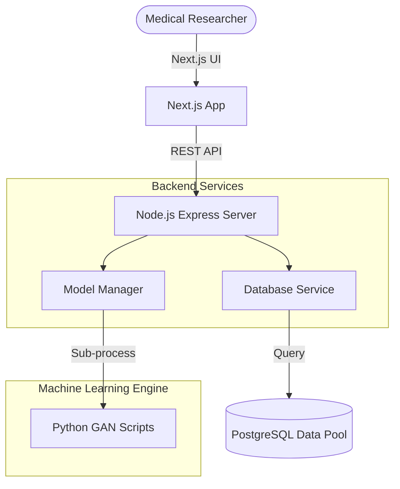

# Synthetic Data Studio (MedSynth) 🧬

   

MedSynth is a **privacy-first synthetic medical data generation platform** built to solve the critical shortage of training data in medical AI research. It uses **Generative Adversarial Networks (GANs)** to produce high-fidelity, clinically accurate synthetic medical images and patient records without exposing any real patient information. 

By removing the regulatory bottlenecks of accessing real hospital data, MedSynth enables faster, more equitable medical AI innovation.

---

## Features

- **Synthetic Cohort Generation**: Upload base dataset and extrapolate massive, statistically identical variants.
- **Privacy Assurance**: Generates zero real patient identifiers (PHI-scrubbed by default).
- **Extensible GAN Training**: Includes support for Image parsing (DICOM/JPG) and Tabular (CSV) clinical records.
- **Role-Based Access Control**: Secure JWT-based isolation between Researchers, Auditors, and Admins.

---

## System Architecture

The MedSynth architecture relies on a decoupled, API-driven design allowing Next.js on the frontend to communicate with a robust Node.js computation backend.



### Identified Design Pattern: Standard Factory Method
We are utilizing the **Factory Method** design pattern for the generative model engine to adhere to the Open-Closed Principle (SOLID).

**Implementation Justification:** MedSynth needs to generate multiple heterogeneous types of data (Medical Images vs Tabular Health Records). Instead of hardcoding conditionals or monolithic initializers in our routing, a `GANFactory` service evaluates the dataset type being passed and dynamically instantiates either an `ImageGAN` or a `TabularGAN` instance. Both conform to a polymorphic `BaseGAN` interface. This allows us to easily add an `ECGGAN` or `TextGAN` in the future without modifying existing backend structures!

---

## Tech Stack

- **Frontend:** Next.js 16 (React 19, TypeScript), TailwindCSS
- **Backend:** Node.js (Express), interacting with Python/PyTorch logic
- **Database:** PostgreSQL (Designed conceptually with Mermaid ER diagrams)

---

## Getting Started

### Prerequisites
- Node 18.x or higher
- Python 3.10+ (for ML scripts)

### Installation Runbook

1. **Clone the repository:**
   ```bash
   git clone https://github.com/adityamathur5836/SD_Capstone.git
   cd SD_Capstone
   ```

2. **Start the Node.js API:**
   ```bash
   cd backend
   npm install
   node index.js
   ```

3. **Start the Next.js Client:**
   ```bash
   cd frontend
   npm install
   npm run dev
   ```